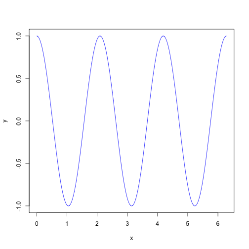

# My first simple Rmd file

Don't forget to install knitr package.


```r
install.packages(c("knitr"))
```


# Introduction

This is an .Rmd document.  Maybe you have heard of Sweave?
Well, knitr is like Sweave, only better!

* can work with markdown files (simpler)
* more flexible re: graphics
* caching
* "modern"

Many of the notes in Rmd are supplied on the github pages for this
bootcamp.  We convert them to .md which github renders.

## A simple example

Let's get R to do some simple maths.


```r
x <- 1:3
y <- 4:6
outer(x, y)
```

```
##      [,1] [,2] [,3]
## [1,]    4    5    6
## [2,]    8   10   12
## [3,]   12   15   18
```

As well as having chunks in separate paragaphs, you can have some
inline computation.  For example, the mean of x is 2 and
the sum of x and y is 5, 7, 9.  Chunks can be named and then
referred to later.

## Plotting is easy too


```r
x <- seq(from = 0, to = 2 * pi, length = 1000)
y <- cos(3 * x)
plot(x, y, type = "l", col = "blue")
```

 


## Tables are not so straightforward (in markdown)

See the
[xtable](http://cran.r-project.org/web/packages/xtable/vignettes/xtableGallery.pdf)
package gallery for more advanced examples.


```r
kable(head(iris[, 1:3]), format = "html")
```

<table>
 <thead>
  <tr>
   <th> Sepal.Length </th>
   <th> Sepal.Width </th>
   <th> Petal.Length </th>
  </tr>
 </thead>
<tbody>
  <tr>
   <td> 5.1 </td>
   <td> 3.5 </td>
   <td> 1.4 </td>
  </tr>
  <tr>
   <td> 4.9 </td>
   <td> 3.0 </td>
   <td> 1.4 </td>
  </tr>
  <tr>
   <td> 4.7 </td>
   <td> 3.2 </td>
   <td> 1.3 </td>
  </tr>
  <tr>
   <td> 4.6 </td>
   <td> 3.1 </td>
   <td> 1.5 </td>
  </tr>
  <tr>
   <td> 5.0 </td>
   <td> 3.6 </td>
   <td> 1.4 </td>
  </tr>
  <tr>
   <td> 5.4 </td>
   <td> 3.9 </td>
   <td> 1.7 </td>
  </tr>
</tbody>
</table>


# Okay, what do you need to know?


1. What is markdown syntax?  [Markdown](http://daringfireball.net/projects/markdown)

2. What can knitr do? [Knitr home page](http://yihui.name/knitr/)


# Exercise:

Take a look at the example for estimating PI using a well-known method
of throwing darts at a dartboard.

[Estimating PI](http://www.damtp.cam.ac.uk/user/eglen/rguide/estimate.pdf)

Can you generate something similar with an .Rmd document?  Work on the
basics of estimating pi and attempt the last figure only if you have
time.

# What are vignettes?

Vignettes are self-contained documents that typically describe in
detail how a package works.  See a list of them with `vignette()`.
*knitr* has many vignettes, e.g. `vignette('knitr-refcard')`.

# Installing vignettes into a package.

knitr vignettes take a bit more work, but not too much.  Put them in
`PKG/inst/doc` or `PKG/vignettes/` folder and follow instructions.
e.g.  for markdown, see the file


```r
system.file("doc", "knitr-markdown.Rmd", package = "knitr")
```

```
## [1] "/Library/Frameworks/R.framework/Versions/3.0/Resources/library/knitr/doc/knitr-markdown.Rmd"
```


# How to compile this document

This should work cross platform; first, the document is knitted to
make a markdown file; then the "markdown" package converts this to
html which can be rendered.


```r
require(knitr)
knit2html("simple.Rmd")
if (interactive()) browseURL("simple.html")
```


In R studio, it is even simpler; just hit the special "Knit HTML" button!

If you prefer the pdf format you need to have a latex compiler, so the
following may not work for you (especially on Windows):


```r
require(knitr)
knit2html("simple.Rmd")
browseURL("simple.html")
knit2pdf("simple.Rmd")
```


## About this document


```r
sessionInfo()
```

```
## R version 3.0.2 (2013-09-25)
## Platform: x86_64-apple-darwin10.8.0 (64-bit)
## 
## locale:
## [1] en_GB.UTF-8/en_GB.UTF-8/en_GB.UTF-8/C/en_GB.UTF-8/en_GB.UTF-8
## 
## attached base packages:
## [1] stats     graphics  grDevices utils     datasets  methods   base     
## 
## other attached packages:
## [1] knitr_1.4.1
## 
## loaded via a namespace (and not attached):
## [1] digest_0.6.3   evaluate_0.4.7 formatR_0.9    stringr_0.6.2 
## [5] tools_3.0.2
```

